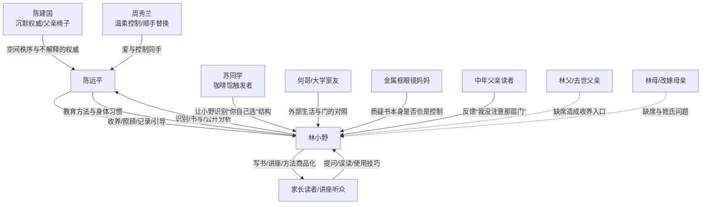

## Mermaid 图谱

## 核心关系说明

### 陈远平 -> 林小野

这不是简单的施害关系，而是“真实照顾 + 真实控制”的混合关系。

陈远平给小野提供了稳定、食物、教育、房间、书、陪伴，也同时把小野放进自己的观察系统里。他不禁止，而是整理选项；不命令，而是给信息；不惩罚，而是让小野自己走到预设答案。

### 林小野 -> 陈远平

小野后期不是单纯复仇者，而是陈远平方法的继承者和反向解释者。

他写《听话》，把陈远平从“家人”变成“案例”。这既是反抗，也是复制：观察、记录、分类、讲解，全部来自陈远平。

### 陈建国 -> 陈远平

陈建国代表硬权威。他不用解释，椅子就是他的。这个关系给陈远平留下了“位置不可侵犯”的身体记忆。

陈远平以为自己反抗了父亲，因为他换成了温和语言。但椅子逻辑仍然传了下来。

### 周秀兰 -> 陈远平

周秀兰是更重要的源头。她不是粗暴命令，而是用关心完成控制。

她的“顺手”比陈建国的沉默更接近陈远平后来的方法：把漫画换成单词册，把选择换成合理取舍，把爱和控制放在同一只手里。

### 林小野 -> 家长读者

第三部的伦理张力来自这里。

小野想帮读者识别控制，但他的分析方法可能被读者拿去进行更精确的控制。读者既是被帮助者，也是小野方法的新实验场。

## 人物弧线

| 人物 | 起点 | 转折 | 终点 |
|---|---|---|---|
| 陈远平 | “我给孩子自由选择” | 小野指出他没有问过真正想要什么 | 承认不确定，拆弹簧扣，转椅子，划掉姓 |
| 林小野 | 安静、懂事、被观察 | 旧教材看到两代模具，开始写书 | 承认自己也在复制方法，用“不知道”继续提问 |
| 陈建国 | 沉默权威 | 只存在于陈远平身体记忆里 | 被陈远平和小野共同识别为源头之一 |
| 周秀兰 | 温柔控制 | 被陈远平误读为“我不同于她” | 显示出陈远平真正继承的是她 |
| 苏同学 | 咖啡馆抱怨男友 | 让小野照见自己 | 功能性触发者，可扩展 |
| 金属框眼镜妈妈 | 读者/质疑者 | 问“为什么还要买你的书” | 把书的伦理问题推到台前 |

## 关系强度

| 关系 | 强度 | 当前问题 |
|---|---:|---|
| 陈远平 - 林小野 | 5/5 | 已经足够强，不必再加解释 |
| 陈远平 - 周秀兰 | 4/5 | 可以保留一两个更具体童年场景 |
| 陈远平 - 陈建国 | 3.5/5 | 功能清楚，但略符号化 |
| 小野 - 苏同学 | 2.5/5 | 很好用，但出现后消失，可稍微回收 |
| 小野 - 何哥 | 2/5 | 外部世界功能偏弱 |
| 小野 - 读者群体 | 4/5 | 第三部关键，可加强分歧和误读 |

## 建议增加或强化的关系节点

1. **何哥**：让他不只是室友，而是小野第一次看到“随意、不对齐也能生活”的人。
2. **苏同学**：后文可让她读到《听话》，给小野一个反馈，形成回收。
3. **金属框眼镜妈妈**：可成为第三部最重要的外部反驳者，不只是一次提问。
4. **陈远平旧同事/导师**：用于显示陈远平的方法不是家庭个案，也曾被学术系统奖励。
